# Tugas Minggu 4

Nama : Qalbii Azzahra Putra

Kelas : TI 3C (17)

Mata Kuliah : Big Data

NIM : 2041720252

# Praktikum

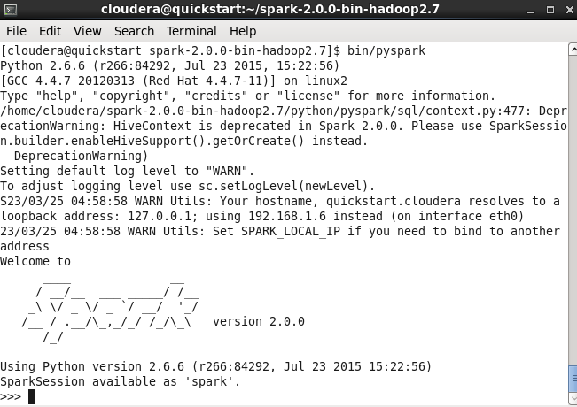

Menjalankan service dari PySpark Sebelum melakukan uji coba kode- kode yang telah di sediakan.

## 1. Uji coba <code>Accumulator.py</code>

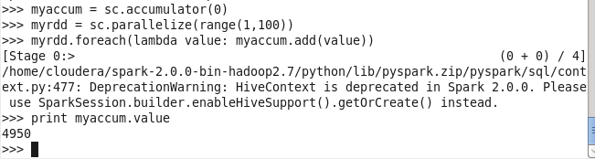

## 2. Uji coba <code>BroadCast.py</code>

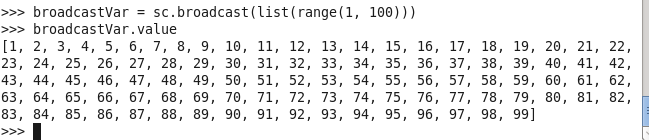

## 3. Uji coba <code>LogAnalytics.py</code>

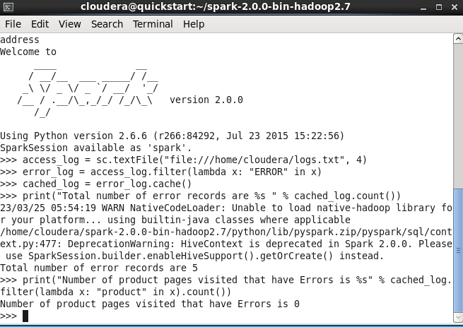

## 4. Uji coba <code>PairRDD.py</code>

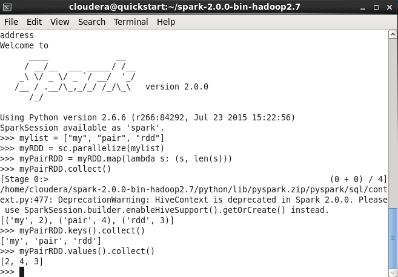

## 5. Uji coba <code>UnderstandingRDD.py</code>

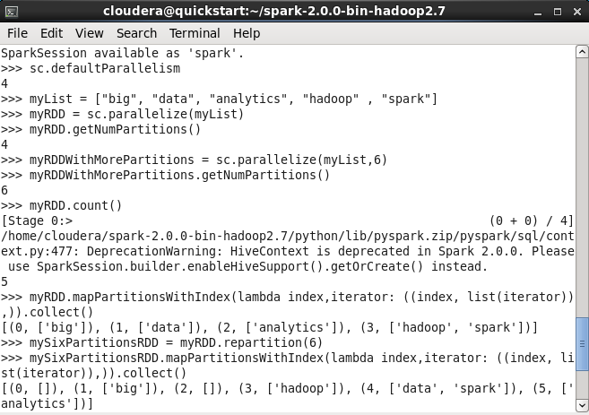
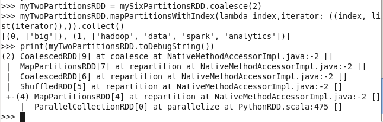

## 6. Uji coba <code>WordCount.py</code>

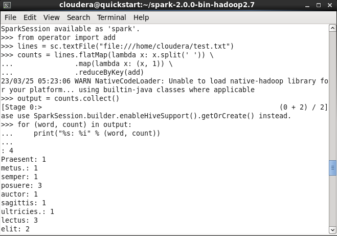

# Uji Coba Scala

Menjalankan service dari sparkshell terlebih dahulu.

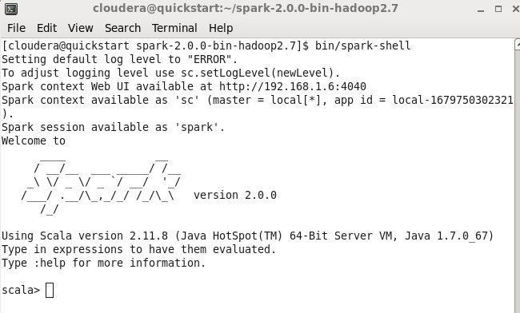

Jalankan juga service cloudera manager dengan perintah:

<code>sudo /home/cloudera/cloudera-manager --express --force</code>

kemudian login pada browser. Setelah itu, jalankan service HDFS

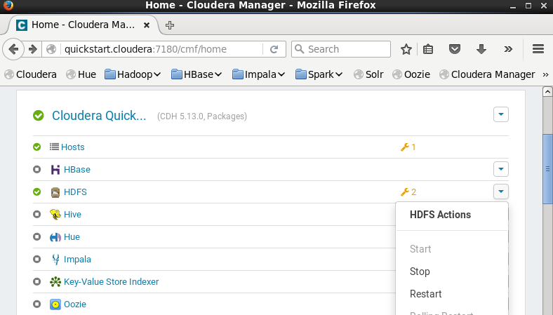

## 1. Uji coba <code>SystemCommandsOutput.scala</code>

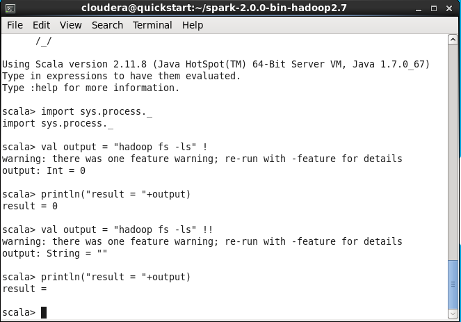

## 2. Uji coba <code>SystemCommandsReturnCode.scala</code>

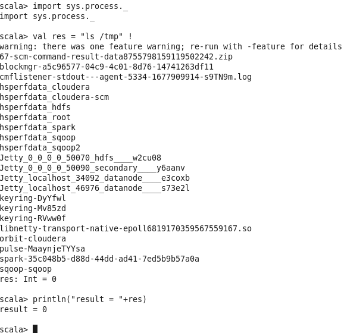

# Tugas Praktikum

1. Kode 1
    * sc : instansiasi dari spark context
    * accumulator : bertujuan akumulasi shared variable
    * parallelize : method pada spark context yang digunakan untuk membuat RDD (Collection).
    * lambda : melakukan transformasi data pada RDD
    * value : kumpulan data yang dapat dibagi menjadi beberapa bagian (partisi) dan didistribusikan ke beberapa node dalam sebuah cluster.

2. Kode 2
    * broadcast : mengoptimalkan pengiriman data ke worker node dalam sebuah cluster sesuai range.
    * list : menyimpan dan memproses kumpulan data yang terdistribusi di beberapa node (dalam bentuk array)
    * range : menghitung collection pada rentang bilangan tertentu.

3. Kode 3
    * textFile : membaca file teks pada Spark dan mengubahnya menjadi RDD
    * filter : memfilter elemen-elemen RDD berdasarkan kondisi yang diberikan.
    * cache : menyimpan RDD dalam memori pada node-node dalam sebuah cluster.
    * count : menghitung jumlah elemen dalam RDD.

4. Kode 4
    * map : melakukan looping pada collection / RDD
    * collect : berisi elemen dengan tipe data dinamis dalam bentuk list
    * len : menghitung nilai dari suatu variabel
    * keys : kunci / keys dalam sebuah collection / RDD seperti konsep array
    * values : nilai dalam sebuah collection / RDD seperti konsep array

5. Kode 5
    * defaultParallelism : menentukan jumlah partisi default yang akan dibuat ketika membuat RDD
    * getNumPartitions : untuk mendapatkan jumlah partisi dari RDD
    * mapPartitionsWithIndex : untuk melakukan pemrosesan looping pada setiap partisi dari RDD
    * repartition: memindahkan data dari satu partisi ke partisi lainnya secara acak
    * coalesce: untuk mengurangi jumlah partisi dari RDD 
    * toDebugString : untuk menampilkan informasi detail tentang RDD

6. Kode 6
    * flatMap : memproses looping setiap elemen pada RDD dan menghasilkan output dalam bentuk koleksi yang dapat berbeda-beda, termasuk dalam bentuk array, list, atau tuple.
    * reduceByKey : untuk menghitung jumlah pada kunci / keys tertentu pada RDD.
    * split : memecah sebuah string menjadi beberapa bagian berdasarkan sebuah pemisah (delimiter) tertentu.
